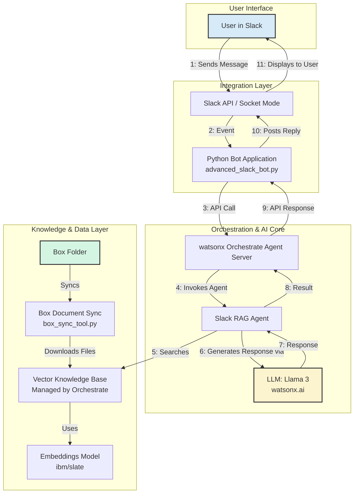

# Building a RAG Chatbot with watsonx Orchestrate and Slack Integration

## 1. Overview

This project provides a comprehensive solution for building a sophisticated RAG (Retrieval-Augmented Generation) chatbot using **watsonx Orchestrate**. The chatbot seamlessly integrates with **Slack** and leverages documents stored in **Box** as its knowledge base.

This repository contains all the necessary code and configuration files to take you from a local development environment to a production-ready deployment.




---

## 2. Key Features

-   **Box Integration**: Automatically syncs documents from a specified Box folder to create and update the knowledge base.
-   **Advanced RAG**: Utilizes IBM's `slate-125m-english-rtrvr-v2` embeddings model for superior document retrieval and semantic search.
-   **Powerful LLM**: Powered by `meta-llama/llama-3-2-90b-vision-instruct` for intelligent, context-aware responses.
-   **Native Slack Integration**: Engages with users through mentions, direct messages, and channel interactions using Socket Mode for real-time communication.
-   **Enterprise-Ready**: Includes built-in guardrails, response citations, confidence thresholds, and automated query rewriting.
-   **Developer Friendly**: Comes with a complete local development environment powered by the watsonx Orchestrate Developer Edition and a `Makefile` for easy setup and execution.

---

## 3. Architecture

The solution is built upon the **watsonx Orchestrate Agent Development Kit (ADK)**. Documents from a Box folder are periodically downloaded and indexed into a vector store using the `slate` embeddings model. This knowledge base is then attached to a native agent.

The Slack integration is handled by a Python application that listens for events. When a user interacts with the chatbot in Slack, the application calls the watsonx Orchestrate agent, which processes the query, searches the knowledge base, generates a response using the Llama 3 model, and sends it back to the user in Slack.

---

## 4. File Manifest

Here is a breakdown of the project structure:

```
📁 rag-chatbot-watsonx-slack/
│
├── Makefile                  # Automates common development tasks
├── .env.example              # Example environment file
├── .env                      # Your local environment credentials (ignored by git)
├── requirements.txt          # Python dependencies
│
├── 📁 documents/             # Local cache for documents synced from Box
│
├── knowledge_base_box.yaml   # Defines the knowledge base configuration
├── rag_agent.yaml            # Defines the core RAG agent
├── enhanced_rag_agent.yaml   # Adds Slack tools to the RAG agent
│
├── box_sync_tool.py          # Utility to download documents from Box
├── sync_and_import.py        # Script to sync docs and update the knowledge base
├── scheduled_box_sync.py     # Optional script to automate syncing
├── slack_bot.py              # Initial Slack integration tools
└── advanced_slack_bot.py     # The complete, asynchronous Slack bot application
```

---

## 5. Getting Started

To get started, please refer to the [SETUP.md](./docs/SETUP.md) file for detailed, step-by-step instructions on how to configure and run the project.
